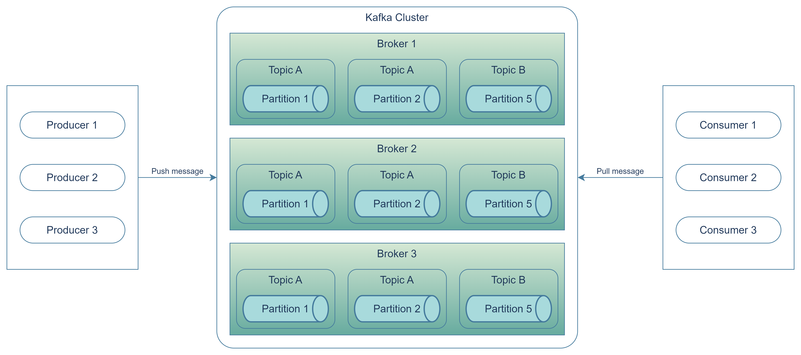

# What is Apache Kafka?

Apache Kafka is an open-source distributed event streaming platform for high-performance data pipelines, streaming analytics, data integration, and mission-critical applications.

# What is Confluent Cloud?

Confluent Cloud is a fully managed, truly cloud-native Apache Kafka service for integrating and processing all of your data in real-time, no matter where it lives.

# Apache Kafka Architecture

---

Source:

- Apache Kafka: https://kafka.apache.org/
- Confluent Cloud: https://confluent.cloud/
