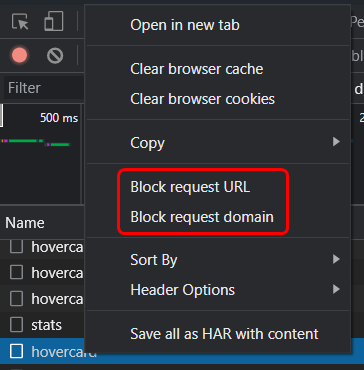

# How to block specific request with Dev Tools

Why trying to simulate a corrupted connection with an specific server, I asked myself, how can I only block requests to a specific url or domain. With Chrome Dev Tools you can right click on one request and choose one option to block it like the screenshot below.

