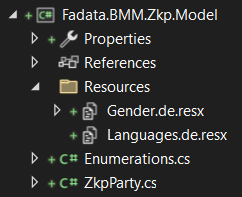

# Create resource file with Visual Studio



# Access resource from another project

First, you have to add project reference into current project.

```c#
var genderRm = new ResourceManager("Fadata.BMM.Zkp.Model.Resources.Gender", typeof(ZkpParty).Assembly);
ResourceSet resources = genderRm.GetResourceSet(new CultureInfo("de"), true, false);
var value = genderRm.GetString("Male");
```