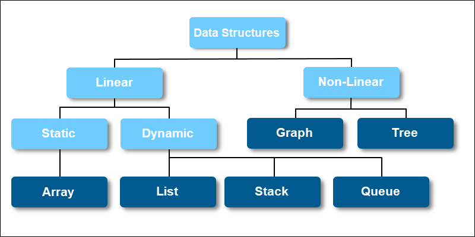

# Definition

A data structure is a way of organizing, and storing data in a computer so that it can be accessed and manipulated efficiently. There are different basic and advanced types of data structures that are used in almost every program or software system that has been developed. Each data structure has its own set of strengths and weaknesses and is suited to different kinds of applications. The choice of data structure depends on factors such as the size of the data, the frequency of access to elements, and the types of operations being performed.

# Classification of Data Structure

## Linear data structure

Data structure in which data elements are arranged sequentially or linearly, where each element is attached to its previous and next adjacent elements, is called a linear data structure.

*Examples of linear data structures are array, stack, queue, linked list, etc.*

- Static data structure: Static data structure has a fixed memory size. It is easier to access the elements in a static data structure.
An example of this data structure is an array.
- Dynamic data structure: In dynamic data structure, the size is not fixed. It can be randomly updated during the runtime which may be considered efficient concerning the memory (space) complexity of the code. 
Examples of this data structure are queue, stack, etc.

## Non-linear data structure

Data structures where data elements are not placed sequentially or linearly are called non-linear data structures. In a non-linear data structure, we can’t traverse all the elements in a single run only.

*Examples of non-linear data structures are trees and graphs.*

---

*Sources: 
https://www.geeksforgeeks.org/data-structures
https://phoenixnap.com/kb/data-structures*