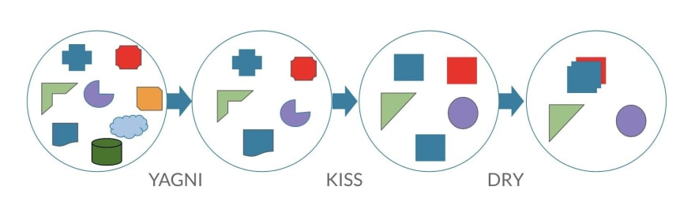

# 3 principles and their order during writing codes

- **YAGNI**: You are not going to need it
- **KISS**: Keep it Simple, Stupid
- **DRY**: Don't Repeat Yourself

*Source: https://dev.to/mariamarsh/5-principles-of-readable-code-kiss-yagni-dry-bdu-occams-razor-2kcp*