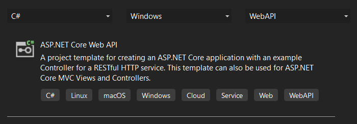
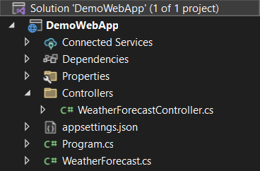
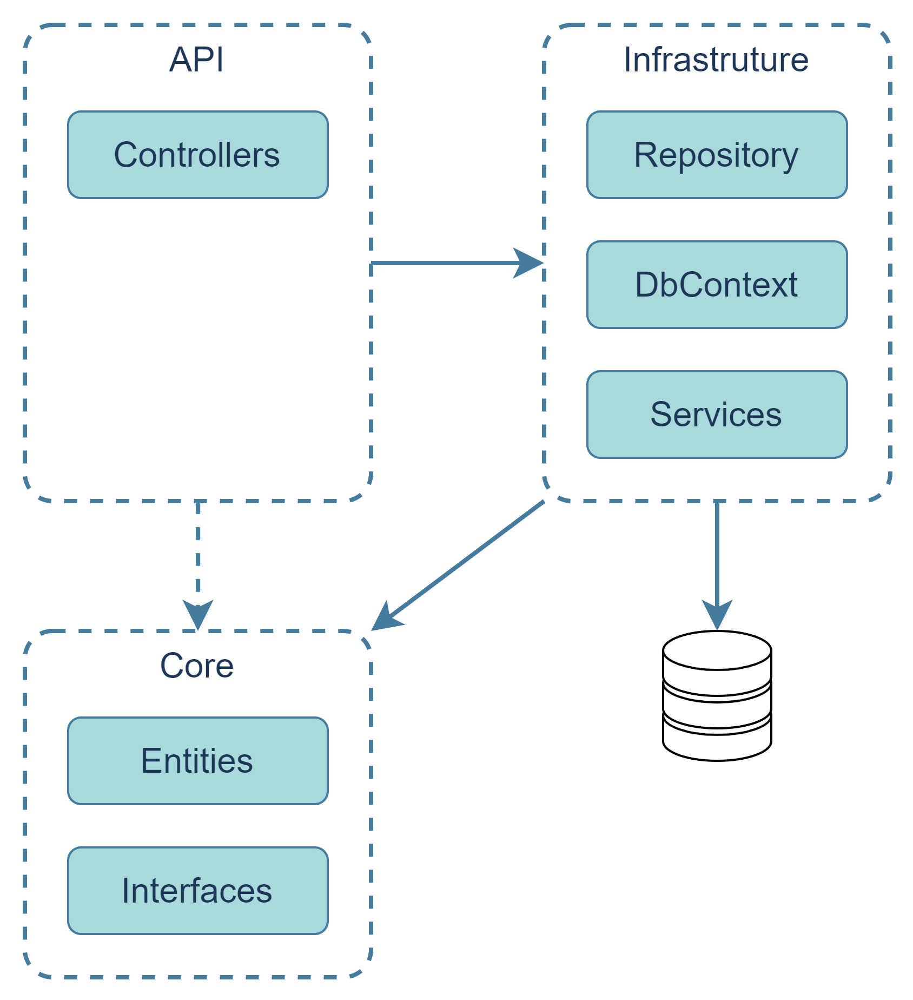
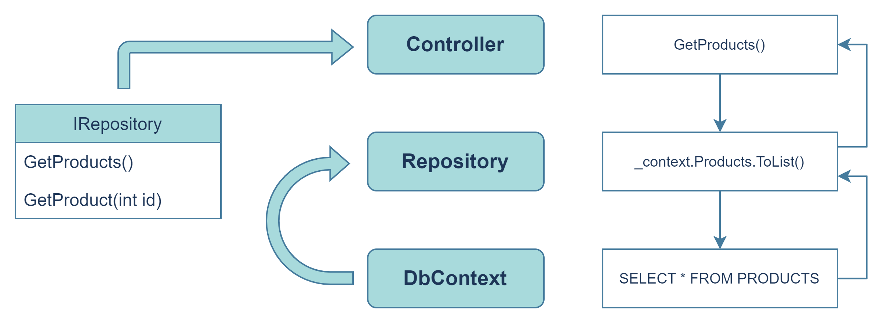

- [Create new Web API project](#create-new-web-api-project)
- [Add Controller into API](#add-controller-into-api)
- [Create Entity class](#create-entity-class)
- [Set up Entity Framework](#set-up-entity-framework)
- [Create StoreContext](#create-storecontext)
- [Set up Connection String for database](#set-up-connection-string-for-database)
  - [Register DbContext service](#register-dbcontext-service)
- [Install one of Entity Framework Core tools](#install-one-of-entity-framework-core-tools)
- [Schema migration](#schema-migration)
  - [Create migration with dotnet-ef](#create-migration-with-dotnet-ef)
  - [Update database](#update-database)
- [Implement a method of Controller](#implement-a-method-of-controller)
- [Project Structure](#project-structure)
- [Repository Pattern](#repository-pattern)

# Create new Web API project

In Visual Studio, add new project with Web API template.



The project will have a pre defined structure and components to help you start to build your own project.



# Add Controller into API

```c#
[ApiController]
[Route("api/[controller]")]
public class WeatherForecastController : ControllerBase
{
  [HttpGet(Name = "GetWeatherForecast")]
  public IEnumerable<WeatherForecast> Get()
  {
    //...
  }
}
```

- `ApiController` indicates that `WeatherForecastController` and all derived types are used to serve HTTP API responses.
- `Route` specifies an attribute route on the controller.
- All controller type must derive from `ControllerBase`, an base class for an MVC controller without view support.
- `HttpGet` identifies an action that supports the HTTP GET method. If the method should have a custom name, please use property `Name` of the `HttpGet` attribute.

# Create Entity class

```c#
public class Product
{
  public string Name { get; set; }
  public string Description { get; set; }
  public decimal Price { get; set; }
}
```

Entity is a class, which often used to represent a single row of a database table. So, we will fill this Entity class with data, then save them later into database. By reading data from DB, we create instance of the Entity class with data in it.

# Set up Entity Framework

Install Nuget packages

- `Microsoft.EntityFrameworkCore.Sqlite`
- `Microsoft.EntityFrameworkCore.Design`

with version compatible to .NET in your project.

# Create StoreContext

```c#
public class StoreContext : DbContext
{
  public StoreContext(DbContextOptions<StoreContext> options) : base(options)
  {
  }

  public DbSet<Product> Products { get; set; }

  public DbSet<ProductType> ProductTypes { get; set; }

  public DbSet<ProductBrand> ProductBrands { get; set; }

  protected override void OnModelCreating(ModelBuilder modelBuilder)
  {
    base.OnModelCreating(modelBuilder);
    modelBuilder.ApplyConfigurationsFromAssembly(Assembly.GetExecutingAssembly());
    // ...
  }
}
```

- `StoreContext` is a `DbContext` instance, which represents a session with the database and can be used to query and save instances of your entities. `DbContext` is a combination of the Unit Of Work and Repository patterns. It is easier with these patterns to write unit test and mock data later.
- `DbContextOptions` are the options to be used in `DbContext`.
- Each property in the `StoreContext` represent a database table.

# Set up Connection String for database

Connection String configures, how to connect with the database. The authentication can also be set up here if needed. You can define the Connection String in `appsettings.json` or `appsettings.Development.json` file.

```json
{
  "Logging": {
    "LogLevel": {
      "Default": "Information",
      "Microsoft.AspNetCore": "Warning"
    }
  },
  "ConnectionStrings": {
    "DefaultConnection": "Data source=mydatabase.db"
  }
}
```

- `DefaultConnection`: Name of Connection String
- `Data source`: Syntax for Sqlite data source
- `mydatabase.db`: Name of database

## Register DbContext service

In the main file `program.cs`, register the `DbContext` as a service, so it can be used later in the application.

```c#
builder.Services.AddDbContext<StoreContext>(opt => opt.UseSqlite(builder.Configuration.GetConnectionString("DefaultConnection")));
```

# Install one of Entity Framework Core tools

These tools set can be used to manage Migrations and to scaffold a DbContext and entity types by reverse engineering the schema of a database.

- EF Core Package Manager Console tools (Visual Studio)
- EF Core .NET command-line interface (CLI) tools (cross-platform)

_Source: https://learn.microsoft.com/en-us/ef/core/cli/_

# Schema migration

A schema migration or database migration refers to the management of version-controlled, incremental and reversible changes to relational database schemas.

## Create migration with dotnet-ef

```console
dotnet ef migrations add InitialCreate -o Data/Migrations
```

## Update database

```console
dotnet ef database update
```

# Implement a method of Controller

Your Controller will provide endpoints and their functionalities for the API. Each endpoint is represented with a public method. E.g.:

```c#
[HttpGet("{id}")]
[ProducesResponseType(StatusCodes.Status200OK)]
[ProducesResponseType(typeof(ApiResponse), StatusCodes.Status404NotFound)]
public async Task<ActionResult<Product>> GetProduct(int id)
{
  //...
}
```

- `HttpGet`: Identifies an action that supports the HTTP GET method.
- `ProducesResponseType`: A filter that specifies the type of the value and status code returned by the action.
- `ActionResult<T>`: Enables returning a type deriving from `ActionResult` (e.g., `Ok(Product)`, `NotFound(new ApiResponse(404))`) or return a specific type T (e.g., `Product`).

# Project Structure



- API: Startup project, which contains dependency injection container and middle wares. It is responsible for routing incoming requests to Controllers.
- Infrastructure: Responsible for sending data to database
- Core: Used by other projects and does not depend on any other projects.

# Repository Pattern

Some of benefits when using Repository Pattern in .NET project:

- Decouple business code from data access
- Separation of concerns
- Minimize duplicate query logic
- Testability


