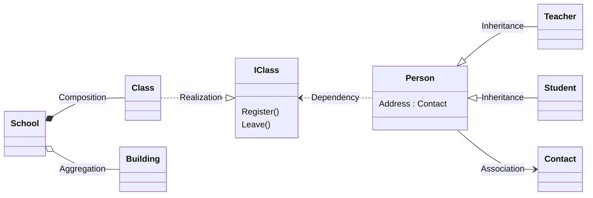

# Class Diagram

```mermaid
classDiagram
direction LR
School *-- Class : Composition
Class ..|> IClass : Realization
IClass <.. Person : Dependency
Person <|-- Teacher : Inheritance
Person <|-- Student : Inheritance
Person --> Contact : Association
School o-- Building : Aggregation
class IClass {
    Register()
    Leave()
}
class Person {
    Address : Contact
}
```